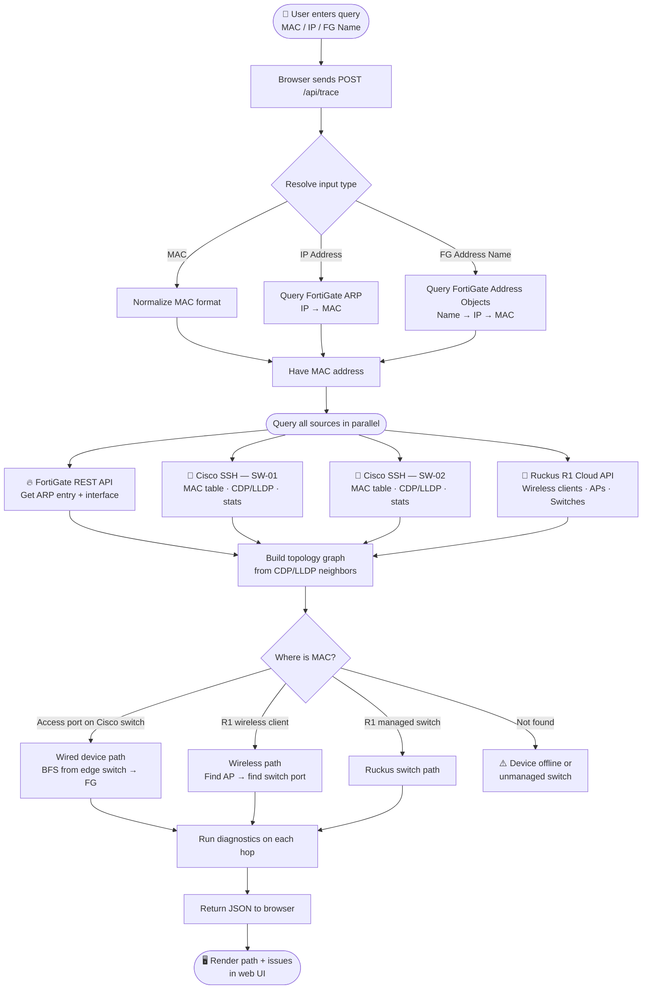
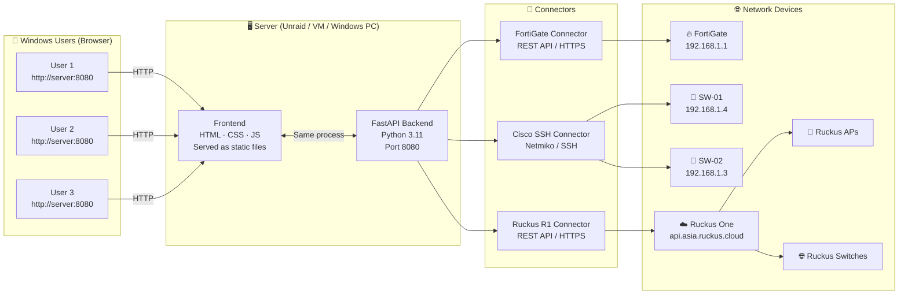
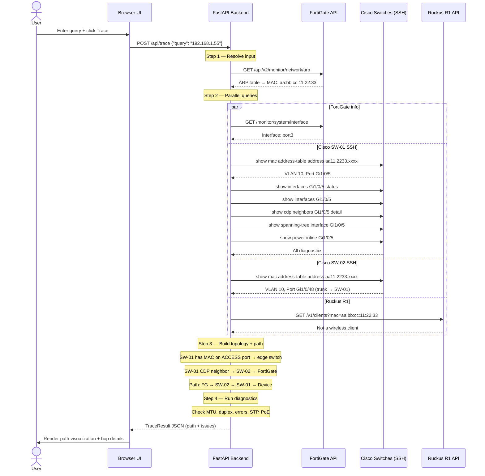

# 🔍 NetInspect

A multi-vendor network troubleshooting platform with a web-based GUI.  
Enter a **MAC address**, **IP address**, or **FortiGate address name** and get a full end-to-end inspection across your FortiGate firewall, Cisco switches, and Ruckus R1 wireless infrastructure — with automated health checks, diagnostics, and issue detection at every hop.

> **Who uses it:** Anyone on your network opens a browser and goes to `http://<server-ip>:8080`. No install required on user machines.

---

## Table of Contents

1. [What It Does](#1-what-it-does)
2. [How It Works — Application Flow](#2-how-it-works--application-flow)
3. [Architecture Diagram](#3-architecture-diagram)
4. [Network Trace Flow](#4-network-trace-flow)
5. [Supported Checks & Diagnostics](#5-supported-checks--diagnostics)
6. [Deployment Options](#6-deployment-options)
   - [Option A — Windows (Easiest for single user)](#option-a--windows-easiest-for-single-user)
   - [Option B — Unraid Docker (Recommended for shared access)](#option-b--unraid-docker-recommended-for-shared-access)
   - [Option C — Linux VM with Docker](#option-c--linux-vm-with-docker)
   - [Option D — Docker Compose (any platform)](#option-d--docker-compose-any-platform)
7. [Configuration Reference](#7-configuration-reference)
8. [Usage Guide](#8-usage-guide)
9. [Troubleshooting](#9-troubleshooting)
10. [Project Structure](#10-project-structure)
11. [Roadmap](#11-roadmap)

---

## 1. What It Does

| Input | Example |
|---|---|
| MAC Address | `aa:bb:cc:dd:ee:ff` or `aabb.ccdd.eeff` |
| IP Address | `192.168.1.55` |
| FortiGate Address Name | `Server-Web-01` |

For any of the above, the tool:

- ✅ Resolves the input to both MAC and IP (via FortiGate ARP table)
- ✅ Traces the full network path: **FortiGate → Core Switch → Access Switch → AP → Device**
- ✅ Identifies whether the device is **wired** or **wireless**
- ✅ Shows device names, IPs, ports, and VLANs at every hop
- ✅ Runs **automated diagnostics** on each hop (see [Section 5](#5-supported-checks--diagnostics))
- ✅ Flags issues with severity levels: 🔴 Critical · ⚠️ Warning · ℹ️ Info

---

## 2. How It Works — Application Flow



---

## 3. Architecture Diagram



---

## 4. Network Trace Flow

This diagram shows the sequence of events during a single trace, from when you click **Trace** to when results appear on screen.



---

## 5. Supported Checks & Diagnostics

Every hop in the path is automatically checked for the following:

| Check | What it detects | Severity |
|---|---|---|
| **Port state** | err-disabled, down, inactive | 🔴 Critical |
| **Duplex** | Half-duplex (causes collisions) | ⚠️ Warning |
| **Speed** | 10 Mbps (negotiation failure) | ⚠️ Warning |
| **MTU consistency** | Mismatch across path (causes fragmentation/drops) | 🔴 Critical |
| **CRC errors** | Bad cable, faulty SFP, duplex mismatch | 🔴 Critical if >100 |
| **Input errors** | High input error count | ⚠️ Warning |
| **Output errors** | Congestion or duplex mismatch | ⚠️ Warning |
| **Runts** | Short frames (duplex mismatch or bad NIC) | ⚠️ Warning |
| **Giants** | Oversized frames (MTU misconfiguration) | ⚠️ Warning |
| **Spanning Tree state** | Port in Blocking/Listening state | ⚠️ Warning |
| **PoE status** | Power denied or fault on AP port | 🔴 Critical |
| **PoE utilization** | Near power budget limit (>90%) | ⚠️ Warning |
| **Wireless RSSI** | Signal below -75 dBm (poor wireless link) | ⚠️ Warning |

---

## 6. Deployment Options

> **All options result in the same outcome:** a web server running on a machine in your LAN.  
> Windows users just open a browser to `http://<server-ip>:8080` — no install needed on their machines.

---

### Option A — Windows (Easiest for single user)

Run the server directly on your Windows PC. Only you (or anyone who can reach your PC) can access it.

#### Prerequisites
- [Python 3.11+](https://www.python.org/downloads/) — during install, **check "Add Python to PATH"**
- Git for Windows *(optional, for cloning)*

#### Steps

**1. Get the code**

Download the ZIP from GitHub and extract it, **or** clone via Git:
```cmd
git clone https://github.com/ivillagomez/netinspect.git
cd netinspect
```

**2. Install dependencies**

Open **Command Prompt** or **PowerShell** in the project folder:
```cmd
pip install -r requirements.txt
```

**3. Edit the config file**

Open `config.yaml` with Notepad++ or VS Code and fill in your FortiGate access token:
```yaml
fortigate:
  host: "192.168.1.1"
  access_token: "paste-your-token-here"   # ← edit this line
```
> See [How to get the FortiGate token](#how-to-get-the-fortigate-access-token) below.

**4. Run the server**
```cmd
python run.py
```

You should see:
```
INFO:     Started server process
INFO:     Waiting for application startup.
INFO:     Application startup complete.
INFO:     Uvicorn running on http://0.0.0.0:8080
```

**5. Open the app**

Open your browser and go to: **http://localhost:8080**

To let others on the LAN access it, share your Windows IP:  
`http://192.168.1.X:8080` (find your IP with `ipconfig` in CMD)

> **Tip:** To keep it running after you close the terminal, use **Task Scheduler** or just keep the window open.

---

### Option B — Unraid Docker (Recommended for shared access)

Run the tool as a Docker container on your Unraid server. Everyone on the LAN can access it 24/7.

#### Prerequisites
- Unraid 6.9+ with Docker enabled
- SSH access to Unraid (or use the Unraid **Terminal** from the web UI)

#### Steps

**1. Open an Unraid terminal**

Either SSH in (`ssh root@<unraid-ip>`) or go to **Tools → Terminal** in the Unraid web UI.

**2. Clone the repo to appdata**
```bash
cd /mnt/user/appdata
git clone https://github.com/ivillagomez/netinspect.git
```

**3. Edit the config**
```bash
nano /mnt/user/appdata/netinspect/config.yaml
```

Find this line and replace the placeholder:
```yaml
access_token: "paste-your-token-here"
```
Save: `Ctrl+O` → Enter → `Ctrl+X`

**4. Build the Docker image**
```bash
cd /mnt/user/appdata/netinspect
docker build -t netinspect:latest .
```
*(This takes ~2 minutes the first time)*

**5. Start the container**
```bash
docker run -d \
  --name netinspect \
  --restart unless-stopped \
  -p 8080:8080 \
  -v /mnt/user/appdata/netinspect/config.yaml:/app/config.yaml:ro \
  netinspect:latest
```

**6. Verify it's running**
```bash
docker ps | grep traffic-analyzer
```

**7. Open the app**

From any Windows machine on your LAN:  
**http://\<unraid-ip\>:8080**

#### Managing via Unraid Docker UI

After step 4 (image build), you can also manage it through the Unraid web interface:

1. Go to the **Docker** tab in Unraid
2. Click **Add Container**
3. Fill in these fields:

| Field | Value |
|---|---|
| Name | `netinspect` |
| Repository | `netinspect:latest` |
| Network Type | `Bridge` |
| Port | Host: `8080` → Container: `8080` |
| Path | Host: `/mnt/user/appdata/netinspect/config.yaml` → Container: `/app/config.yaml` · Access: `Read Only` |
| Restart Policy | `Unless Stopped` |

Click **Apply**.

#### Updating the config later

After editing `config.yaml`, restart the container to apply changes:
```bash
docker restart netinspect
```
Or click **Restart** on the Unraid Docker tab.

---

### Option C — Linux VM with Docker

For a dedicated Ubuntu/Debian VM.

```bash
# 1. Install Docker
curl -fsSL https://get.docker.com | sh

# 2. Clone the repo
git clone https://github.com/ivillagomez/netinspect.git
cd netinspect

# 3. Edit config
nano config.yaml

# 4. Build and run
docker build -t netinspect:latest .
docker run -d \
  --name netinspect \
  --restart unless-stopped \
  -p 8080:8080 \
  -v $(pwd)/config.yaml:/app/config.yaml:ro \
  netinspect:latest
```

Access at `http://<vm-ip>:8080`

---

### Option D — Docker Compose (any platform)

If you have Docker Compose installed (included with Docker Desktop on Windows):

```bash
# 1. Clone + edit config
git clone https://github.com/ivillagomez/netinspect.git
cd netinspect
# Edit config.yaml with your credentials

# 2. Build and start
docker-compose up -d --build

# 3. Stop
docker-compose down
```

---

## 7. Configuration Reference

All settings live in `config.yaml` in the project root.

```yaml
# ── FortiGate ─────────────────────────────────────────────────
fortigate:
  host: "192.168.1.1"          # FortiGate management IP
  port: 443                    # HTTPS port (default: 443)
  access_token: "YOUR_TOKEN"   # REST API access token (see below)
  verify_ssl: false            # Set true if using a trusted cert

# ── Cisco Switches ────────────────────────────────────────────
cisco_switches:
  - name: "SW-01"              # Friendly name shown in UI
    host: "192.168.1.4"        # Management IP
    username: "ivan"           # SSH username
    password: "YOUR_SSH_PASSWORD"       # SSH password
    device_type: "cisco_ios"   # cisco_ios · cisco_nxos · cisco_xe
    timeout: 30                # SSH command timeout in seconds

  - name: "SW-02"
    host: "192.168.1.3"
    username: "ivan"
    password: "YOUR_SSH_PASSWORD"
    device_type: "cisco_ios"
    timeout: 30

# ── Ruckus One (R1) ───────────────────────────────────────────
ruckus_r1:
  base_url: "https://api.asia.ruckus.cloud"   # asia · eu · (blank for NA)
  api_key: "your-r1-api-key"

# ── Web Server ────────────────────────────────────────────────
server:
  host: "0.0.0.0"              # 0.0.0.0 = listen on all interfaces
  port: 8080
```

### How to get the FortiGate access token

1. Log in to your FortiGate web UI
2. Go to **System → Administrators**
3. Click **Create New → REST API Admin**
4. Name it `netinspect`, set **PKI Group** to none
5. Under **Trusted Hosts**, add the IP of the machine running this tool (or `0.0.0.0/0` for any)
6. Copy the generated API key — paste it as `access_token` in `config.yaml`

> The token only needs **read-only** access. You can restrict it to: `Monitor`, `Network`, `Firewall`.

### Supported Cisco device_type values

| Platform | device_type |
|---|---|
| Catalyst 2960, 3650, 3850, 9200, 9300 | `cisco_ios` |
| Catalyst 9000 with IOS-XE | `cisco_xe` |
| Nexus switches | `cisco_nxos` |

---

## 8. Usage Guide

### Searching

Enter any of the following in the search bar:

```
aa:bb:cc:dd:ee:ff       ← MAC with colons
aa-bb-cc-dd-ee-ff       ← MAC with dashes
aabb.ccdd.eeff          ← Cisco-style MAC
192.168.1.55            ← IP address
Server-Web-01           ← FortiGate address object name
```

Press **Enter** or click **Trace**. Results appear in 5–20 seconds depending on switch response times.

### Reading the path

```
[🔥 FortiGate] ──→ [🔌 SW-02] ──→ [🔌 SW-01] ──→ [📡 AP-01] ──→ [💻 Device]
  192.168.1.1          Gi0/48        Gi1/0/5       192.168.1.20   192.168.1.55
```

- **Click any node** in the path to jump to that hop's detailed card
- **Colored dot** on a node = issues found (🔴 critical, 🟡 warning)
- Cards with issues **auto-expand**

### Status indicators

| Badge | Meaning |
|---|---|
| ✅ All clear | No issues found |
| ⚠️ N Warning | Non-critical issues (degraded performance) |
| 🔴 N Critical | Serious issues (connectivity impact likely) |
| 🔍 Not found | MAC not in ARP table or any switch MAC table |

---

## 9. Troubleshooting

### "Could not resolve to a MAC address"
- The device may be **offline** — no ARP entry on FortiGate
- If using IP: check that the device is active and has communicated recently
- If using FortiGate address name: verify the name is exact (case-sensitive)
- The FortiGate ARP cache expires — ping the device first, then trace

### "Device not located on any switch"
- The device may be connected to an **unmanaged switch** not in the tool's list
- Check that the MAC hasn't aged out of the Cisco MAC address table (`show mac address-table aging-time`)
- The device may be on a **VLAN that's not trunked** to any configured switch

### Switch shows as "Unreachable"
- Verify SSH is enabled: `show ip ssh` on the switch
- Check the credentials in `config.yaml`
- Ensure the server running the tool can reach the switch IP (test with `ping` from that machine)
- Check the switch has no ACL blocking SSH from the tool's IP

### FortiGate API errors
- Verify the `access_token` in `config.yaml` is correct
- Check the token's trusted host list in FortiGate includes your tool's IP
- The FortiGate API requires HTTPS — `verify_ssl: false` handles self-signed certs

### Ruckus R1 returns no data
- Confirm the API key is correct and active in the Ruckus One portal
- Verify the `base_url` matches your region: `api.asia.ruckus.cloud` / `api.eu.ruckus.cloud` / `api.ruckus.cloud`
- The R1 API may return empty results if your API key doesn't have access to all venues

### Port 8080 is already in use
Edit `config.yaml` and change `server.port` to another value (e.g., `8090`), then restart.

---

## 10. Project Structure

```
netinspect/
│
├── config.yaml                  ← Your credentials (never commit this with real tokens)
├── run.py                       ← Entry point: starts the web server
├── requirements.txt             ← Python dependencies
├── Dockerfile                   ← For Docker/Unraid deployment
├── docker-compose.yml           ← Docker Compose deployment
│
├── backend/
│   ├── main.py                  ← FastAPI app + static file serving
│   ├── config.py                ← Config loader (YAML + env var support)
│   ├── models.py                ← Pydantic data models (Hop, Issue, TraceResult…)
│   │
│   ├── connectors/
│   │   ├── fortigate.py         ← FortiGate REST API: ARP, address objects, interfaces
│   │   ├── cisco_ssh.py         ← Cisco SSH: MAC table, CDP/LLDP, STP, PoE, stats
│   │   └── ruckus_r1.py        ← Ruckus One API: APs, switches, wireless clients
│   │
│   └── tracer/
│       ├── resolver.py          ← Parses MAC / IP / FG address name input
│       ├── mac_tracer.py        ← Core trace engine (topology BFS + path building)
│       └── diagnostics.py      ← Per-hop health checks (MTU, duplex, errors…)
│
└── frontend/
    ├── index.html               ← Single-page app shell
    ├── css/style.css            ← Dark glassmorphism theme
    └── js/app.js                ← UI logic (fetch, render path, hop cards)
```

### Key data flow

```
User Query
    ↓
resolver.py          → Converts MAC/IP/Name to normalized MAC
    ↓
mac_tracer.py        → Orchestrates parallel queries to all connectors
    ├── fortigate.py → Identifies ARP entry + FG interface
    ├── cisco_ssh.py → Finds MAC on switch port + collects diagnostics
    └── ruckus_r1.py → Looks up wireless clients / R1-managed devices
    ↓
mac_tracer.py        → Builds topology graph from CDP/LLDP, runs BFS
    ↓
diagnostics.py       → Checks each hop for issues
    ↓
TraceResult JSON     → Returned to frontend
    ↓
app.js               → Renders path visualization + hop detail cards
```

---

## 11. Roadmap

| Feature | Status |
|---|---|
| Cisco + FortiGate + Ruckus R1 trace | ✅ v1.0 |
| MTU / duplex / error diagnostics | ✅ v1.0 |
| STP + PoE checks | ✅ v1.0 |
| Wireless RSSI check | ✅ v1.0 |
| Docker / Unraid deployment | ✅ v1.0 |
| Export trace to PDF/CSV | 🔲 Planned |
| Saved trace history | 🔲 Planned |
| SNMP fallback for switches without SSH | 🔲 Planned |
| FortiAnalyzer log correlation (show traffic for traced IP) | 🔲 Planned |
| Email/Teams alert on critical issues | 🔲 Planned |
| Palo Alto firewall support | 🔲 Planned |
| Auto-rediscover switch inventory from CDP/LLDP | 🔲 Planned |

---

## License

Private repository — internal use only.
