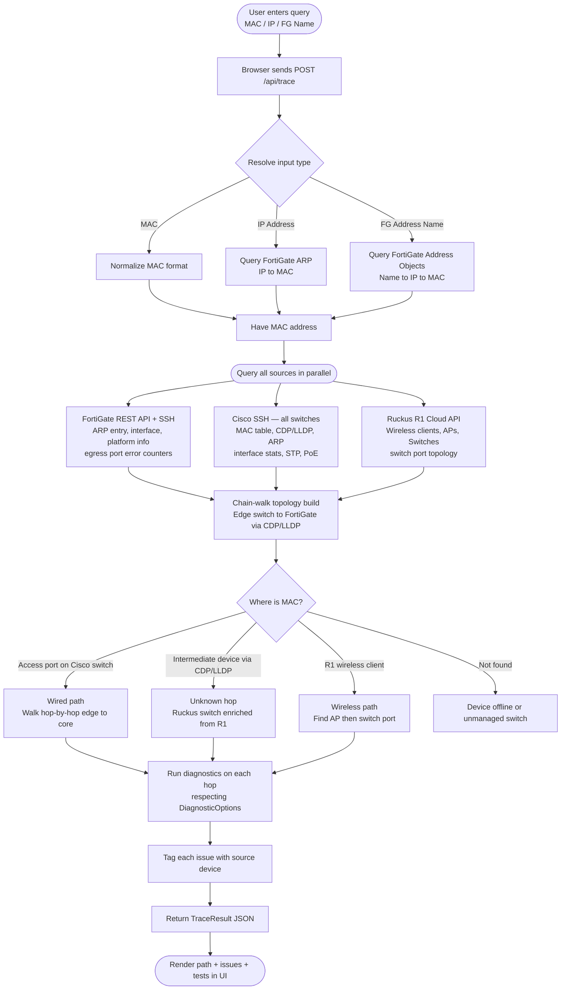
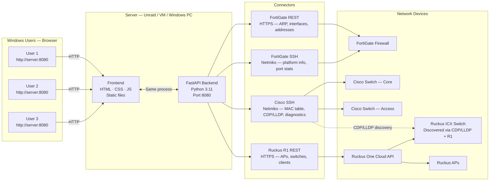
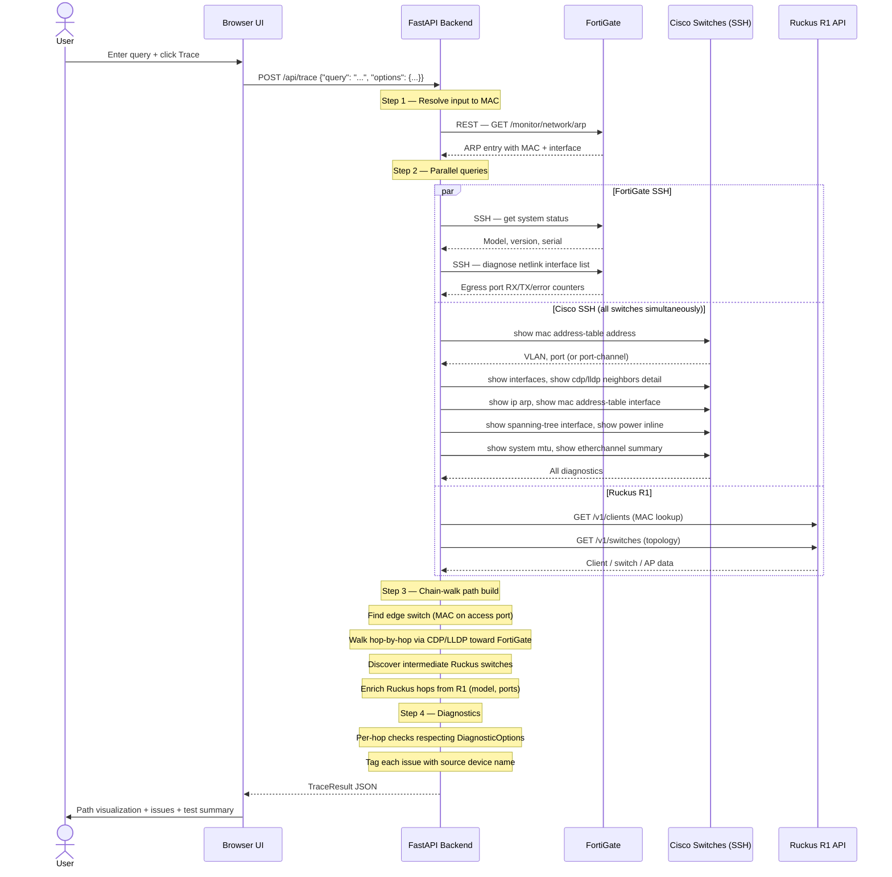

# NetInspect

A multi-vendor network troubleshooting platform with a web-based GUI.
Enter a **MAC address**, **IP address**, or **FortiGate address name** and get a full end-to-end inspection across your FortiGate firewall, Cisco switches, and Ruckus R1 wireless infrastructure — with automated health checks, diagnostics, and issue detection at every hop.

> **Who uses it:** Anyone on your network opens a browser and goes to `http://<server-ip>:8080`. No install required on user machines.

---

## Table of Contents

1. [What It Does](#1-what-it-does)
2. [How It Works — Application Flow](#2-how-it-works--application-flow)
3. [Architecture Diagram](#3-architecture-diagram)
4. [Network Trace Flow](#4-network-trace-flow)
5. [Supported Checks & Diagnostics](#5-supported-checks--diagnostics)
6. [Deployment Options](#6-deployment-options)
   - [Option A — Windows (local)](#option-a--windows-local)
   - [Option B — Unraid Docker (recommended for shared access)](#option-b--unraid-docker-recommended-for-shared-access)
   - [Option C — Linux VM with Docker](#option-c--linux-vm-with-docker)
   - [Option D — Docker Compose (any platform)](#option-d--docker-compose-any-platform)
7. [Configuration Reference](#7-configuration-reference)
8. [Usage Guide](#8-usage-guide)
9. [Troubleshooting](#9-troubleshooting)
10. [Project Structure](#10-project-structure)
11. [Security Notes](#11-security-notes)
12. [Roadmap](#12-roadmap)

---

## 1. What It Does

| Input | Example |
|---|---|
| MAC Address | `aa:bb:cc:dd:ee:ff` · `aa-bb-cc-dd-ee-ff` · `aabb.ccdd.eeff` |
| IP Address | `192.168.1.55` |
| FortiGate Address Name | `Server-Web-01` |

For any of the above, the tool:

- Resolves the input to both MAC and IP via FortiGate ARP table
- Traces the full network path: **FortiGate → Core Switch → Ruckus Switch → Access Switch → AP → Device**
- Handles wired and wireless clients, Port-channel/LAG uplinks, and non-SSH intermediate switches (Ruckus ICX)
- Shows device names, vendor/model, IPs, VLANs, and physical port connections at every hop
- Runs **automated diagnostics** on each hop (see [Section 5](#5-supported-checks--diagnostics))
- Flags issues with severity levels: Critical · Warning · Info
- Shows **which device** generated each issue

---

## 2. How It Works — Application Flow



---

## 3. Architecture Diagram



---

## 4. Network Trace Flow



---

## 5. Supported Checks & Diagnostics

Each check can be individually enabled or disabled from the **Diagnostics options panel** in the UI (gear icon below the search bar).

### Per-hop checks (Cisco switches)

| Check | What it detects | Severity |
|---|---|---|
| **Interface Status** | Port err-disabled, down, inactive | Critical |
| **Duplex** | Half-duplex (causes collisions) | Warning |
| **Speed** | 10 Mbps (negotiation failure) | Warning |
| **Error Counters** | CRC errors, input/output errors, runts, giants | Critical / Warning |
| **MTU** | Non-standard per-interface MTU; shows whether value is global default or per-interface override | Warning |
| **MTU Consistency** | Mismatch across path (causes fragmentation / drops) | Critical |
| **Spanning Tree** | Port in Blocking or transitional state | Warning |
| **PoE Status** | Power denied, fault, or near budget limit (>90%) | Critical / Warning |

### Uplink port counters

For every Cisco switch, error counters are also collected on the **uplink-facing port** toward upstream devices (e.g. the Cisco port connecting to the Ruckus switch). This surfaces physical-layer errors on the Ruckus-to-Cisco link even though the Ruckus switch is not SSH-accessible.

### Port-channel / LAG

When a MAC address is found on a **Port-channel** interface (`Po1`, etc.), the individual member link states are reported (`show etherchannel summary`) — showing which physical ports are bundled, down, or suspended.

### FortiGate egress interface

When SSH credentials are configured for the FortiGate, the egress interface (the port where the traced device's traffic enters the firewall) is checked for RX/TX/error/drop counters via `diagnose netlink interface list`.

### Wireless checks (Ruckus R1)

| Check | What it detects | Severity |
|---|---|---|
| **RSSI** | Signal below −75 dBm (poor wireless link) | Warning |

---

## 6. Deployment Options

> **All options result in the same outcome:** a web server on your LAN at `http://<server-ip>:8080`.
> Windows users just open a browser — no install needed on their machines.

---

### Option A — Windows (local)

Run directly on a Windows PC. Suitable for single-user or testing.

#### Prerequisites
- [Python 3.11+](https://www.python.org/downloads/) — check **"Add Python to PATH"** during install

#### Steps

```cmd
:: 1. Clone the repo
git clone https://github.com/ivillagomez/netinspect.git
cd netinspect

:: 2. Install dependencies
pip install -r requirements.txt

:: 3. Create your local config (never commit this file)
copy config.yaml config.yaml
:: Edit config.yaml with Notepad++ or VS Code — fill in your credentials

:: 4. Run the server
python run.py
```

Open: **http://localhost:8080**

To share with others on the LAN: `http://<your-windows-ip>:8080`  
Find your IP with `ipconfig` in CMD.

---

### Option B — Unraid Docker (recommended for shared access)

24/7 access for everyone on the LAN.

#### Prerequisites
- Unraid 6.9+ with Docker enabled

#### Steps

```bash
# 1. Open Unraid Terminal (Tools → Terminal) or SSH in

# 2. Clone the repo
cd /mnt/user/appdata
git clone https://github.com/ivillagomez/netinspect.git

# 3. Create and edit your local config
cd netinspect
cp config.yaml config.local.yaml   # optional: keep a backup
nano config.yaml                   # fill in your real credentials
# Ctrl+O → Enter → Ctrl+X to save

# 4. Build the Docker image (~2 min first time)
docker build -t netinspect:latest .

# 5. Start the container
docker run -d \
  --name netinspect \
  --restart unless-stopped \
  -p 8080:8080 \
  -v /mnt/user/appdata/netinspect/config.yaml:/app/config.yaml:ro \
  netinspect:latest

# 6. Verify it's running
docker ps | grep netinspect
```

Open from any LAN machine: **http://\<unraid-ip\>:8080**

#### Managing via Unraid Docker UI

After the image is built, you can manage it through the Unraid web UI (Docker tab → Add Container):

| Field | Value |
|---|---|
| Name | `netinspect` |
| Repository | `netinspect:latest` |
| Network Type | `Bridge` |
| Port | Host `8080` → Container `8080` |
| Path | Host `/mnt/user/appdata/netinspect/config.yaml` → Container `/app/config.yaml` · Read Only |
| Restart Policy | `Unless Stopped` |

#### Updating config later

```bash
nano /mnt/user/appdata/netinspect/config.yaml
docker restart netinspect
```

---

### Option C — Linux VM with Docker

```bash
# 1. Install Docker
curl -fsSL https://get.docker.com | sh

# 2. Clone + configure
git clone https://github.com/ivillagomez/netinspect.git
cd netinspect
nano config.yaml    # fill in credentials

# 3. Build and run
docker build -t netinspect:latest .
docker run -d \
  --name netinspect \
  --restart unless-stopped \
  -p 8080:8080 \
  -v $(pwd)/config.yaml:/app/config.yaml:ro \
  netinspect:latest
```

---

### Option D — Docker Compose (any platform)

```bash
git clone https://github.com/ivillagomez/netinspect.git
cd netinspect
nano config.yaml         # fill in credentials

docker compose up -d --build     # start
docker compose down              # stop
```

---

## 7. Configuration Reference

`config.yaml` lives in the project root and is **excluded from git** (see [Section 11](#11-security-notes)).  
Copy the template below and fill in your values.

```yaml
# ── FortiGate ─────────────────────────────────────────────────
fortigate:
  host: "192.168.1.1"                  # FortiGate management IP
  port: 443                            # HTTPS port (default: 443)
  access_token: "YOUR_API_TOKEN"       # REST API access token (see below)
  verify_ssl: false                    # Set true if using a trusted TLS cert
  ssh_username: "YOUR_SSH_USERNAME"    # SSH admin user (for egress port stats)
  ssh_password: "YOUR_SSH_PASSWORD"    # SSH admin password
  ssh_port: 22                         # SSH port (default: 22)

# ── Cisco Switches ─────────────────────────────────────────────
cisco_switches:
  - name: "SW-Core"                    # Friendly name shown in the UI
    host: "192.168.1.x"                # Management IP
    username: "YOUR_SSH_USERNAME"
    password: "YOUR_SSH_PASSWORD"
    device_type: "cisco_ios"           # See table below
    timeout: 30                        # SSH timeout in seconds

  - name: "SW-Access"
    host: "192.168.1.x"
    username: "YOUR_SSH_USERNAME"
    password: "YOUR_SSH_PASSWORD"
    device_type: "cisco_ios"
    timeout: 30

  # Add as many switches as needed

# ── Ruckus One (R1) ────────────────────────────────────────────
ruckus_r1:
  base_url: "https://api.asia.ruckus.cloud"   # Region: asia | eu | (blank = NA)
  api_key: "YOUR_RUCKUS_R1_API_KEY"

# ── Web Server ─────────────────────────────────────────────────
server:
  host: "0.0.0.0"                      # 0.0.0.0 = all interfaces
  port: 8080
```

### How to get the FortiGate API token

1. Log in to FortiGate web UI
2. Go to **System → Administrators → Create New → REST API Admin**
3. Name it `netinspect`, PKI Group: none
4. Under **Trusted Hosts**, add the IP of the machine running this tool (or `0.0.0.0/0` for any)
5. Copy the generated token → paste as `access_token`

> The token only needs **read-only** access. Restrict to: `Monitor`, `Network`, `Firewall`.

### FortiGate SSH (optional but recommended)

When `ssh_username` and `ssh_password` are set, the tool will also connect via SSH to retrieve:
- Device model, version, and serial number (`get system status`)
- RX/TX/error/drop counters on the egress interface (`diagnose netlink interface list`)

If left blank, the tool falls back to REST API data (less detail, no error counters).

### Supported `device_type` values

| Cisco Platform | device_type |
|---|---|
| Catalyst 2960, 3650, 3850, 9200, 9300 | `cisco_ios` |
| Catalyst 9000 with IOS-XE | `cisco_xe` |
| Nexus switches | `cisco_nxos` |

---

## 8. Usage Guide

### Searching

Type any of the following in the search bar and press **Enter** or click **Trace**:

```
aa:bb:cc:dd:ee:ff       MAC — colon-separated
aa-bb-cc-dd-ee-ff       MAC — dash-separated
aabb.ccdd.eeff          MAC — Cisco/Ruckus dotted format
192.168.1.55            IP address
Server-Web-01           FortiGate address object name
```

Results appear in 5–20 seconds depending on the number of switches and their response times.

### Diagnostic options

Click the **gear icon** below the search bar to expand the diagnostics panel. Toggle individual checks on or off before running a trace:

| Option | What it runs |
|---|---|
| **Interface Status** | `show interfaces {port} status` — port up/down, duplex, speed |
| **Error Counters** | `show interfaces {port}` — CRC, input/output errors, runts, giants |
| **MTU Check** | Per-interface MTU vs. global `show system mtu`; cross-hop consistency |
| **Spanning Tree** | `show spanning-tree interface {port}` — role and state |
| **PoE Status** | `show power inline {port}` — power delivery and budget |
| **Neighbor Info** | Per-port CDP/LLDP `detail` — connected device name and port |

Disabling options speeds up traces and reduces SSH commands on the switches.

### Reading results

**Path visualization** — left to right: FortiGate → switches → (AP) → device
- Click any node to jump to its detail card
- Port labels between nodes show the physical connection (e.g. `Gi1/0/24 ↔ Gi0/1`)
- Issue dot on a node = problems found (red = critical, amber = warning)

**Issues Found** — each issue shows:
- Severity badge (Critical / Warning / Info)
- **Device name** where the issue was found
- Message and detail with recommended action

**Diagnostic Tests** — pass/fail/warning summary across all hops; individual results visible per hop card when expanded.

**Hop detail cards** — expand any card for:
- Vendor, model, software version, IP
- Ingress and egress physical ports
- Interface status, error counters, MTU context
- CDP/LLDP neighbor, STP state, PoE power
- Port-channel member link states
- Uplink port error counters (Cisco side of Ruckus links)
- FortiGate egress interface statistics (when SSH configured)

---

## 9. Troubleshooting

### "Could not resolve to a MAC address"
- Device may be offline — no ARP entry on FortiGate
- If using IP: ping the device first to refresh the ARP cache, then trace
- If using FortiGate address name: check the name is exact and matches the address object

### "Device not located on any switch"
- Device may be behind an **unmanaged switch** not in the tool's list
- MAC may have aged out: check `show mac address-table aging-time` on switches
- Device may be on a VLAN not trunked to any configured switch

### Switch shows as "Unreachable"
- Verify SSH is enabled: `show ip ssh` on the switch
- Test connectivity from the server: `ssh <username>@<switch-ip>`
- Check no ACL is blocking SSH from the tool's IP
- Confirm credentials in `config.yaml` are correct

### FortiGate API errors
- Verify `access_token` is correct and not expired
- Confirm the token's trusted host includes the tool server's IP
- `verify_ssl: false` is required for self-signed certificates

### FortiGate SSH not working
- Confirm `ssh_username` and `ssh_password` in `config.yaml` are set
- Test manually: `ssh <username>@<fortigate-ip>`
- If SSH works but model info is missing, the `get system status` output format may differ slightly — check logs

### Ruckus R1 returns no data
- Confirm the API key is valid in the Ruckus One portal
- Verify `base_url` matches your region: `api.asia.ruckus.cloud` / `api.eu.ruckus.cloud` / `api.ruckus.cloud`
- API key may not have access to all venues

### Ruckus switch shows no ports
- The Ruckus ICX switch is discovered via CDP/LLDP from the Cisco switch — it does not need SSH credentials
- Port data comes from R1 port type classification (TRUNK/UPLINK/ACCESS)
- If ports are missing, CDP/LLDP may not be advertising port IDs for that switch

### Port 8080 already in use
Edit `config.yaml`, change `server.port` to another value (e.g. `8090`), restart.

---

## 10. Project Structure

```
netinspect/
│
├── config.yaml                  ← Your credentials — gitignored, never committed
├── run.py                       ← Entry point: starts the uvicorn server
├── requirements.txt             ← Python dependencies
├── Dockerfile                   ← Container image definition
├── docker-compose.yml           ← Docker Compose deployment
│
├── backend/
│   ├── main.py                  ← FastAPI app + routes + static file serving
│   ├── config.py                ← Config loader (YAML → Pydantic models)
│   ├── models.py                ← Pydantic data models (Hop, Issue, TraceResult…)
│   │
│   ├── connectors/
│   │   ├── fortigate.py         ← FortiGate REST API: ARP table, address objects, interfaces
│   │   ├── fortigate_ssh.py     ← FortiGate SSH: platform info, egress port counters
│   │   ├── cisco_ssh.py         ← Cisco SSH: MAC table, CDP/LLDP, ARP, STP, PoE, etherchannel
│   │   └── ruckus_r1.py        ← Ruckus One REST: APs, managed switches, wireless clients
│   │
│   └── tracer/
│       ├── resolver.py          ← Parses MAC / IP / FortiGate address name input
│       ├── mac_tracer.py        ← Core engine: chain-walk topology + path building
│       └── diagnostics.py      ← Per-hop health checks returning (issues, tests) tuples
│
└── frontend/
    ├── index.html               ← Single-page app shell + diagnostics options panel
    ├── css/style.css            ← Dark glassmorphism theme
    └── js/app.js                ← UI: trace, path render, hop cards, tests summary
```

### Data flow

```
User Query (MAC / IP / FG name)
    ↓
resolver.py          Normalizes input → MAC + IP

mac_tracer.py        Orchestrates parallel queries:
    ├── fortigate.py + fortigate_ssh.py   ARP entry, egress interface, FG platform
    ├── cisco_ssh.py (all switches)        MAC table, CDP/LLDP, diagnostics, ARP
    └── ruckus_r1.py                       Wireless clients, AP info, switch ports

mac_tracer.py        Chain-walk: edge switch → upstream via CDP/LLDP
                     Unknown hops (Ruckus ICX) enriched from R1
                     Port connections tracked at every hop

diagnostics.py       Per-hop checks gated by DiagnosticOptions
                     Issues tagged with source device name

TraceResult JSON     Returned to frontend

app.js               Renders path nodes, hop cards, issues panel, test summary
```

---

## 11. Security Notes

### config.yaml is gitignored

`config.yaml` is listed in `.gitignore` and **must never be committed with real credentials**.  
The file in the repository contains only placeholder values.

When deploying:
1. Clone the repo
2. Edit `config.yaml` locally with your real credentials
3. It will not be tracked by git

### Credential exposure in git history

> **Action required if making this repository public.**

Earlier development commits included real credentials in `config.yaml` before `.gitignore` was updated. If you intend to make this repo public or share it outside your organization:

1. **Rotate all credentials immediately:**
   - Generate a new FortiGate API token (System → Administrators)
   - Change the FortiGate SSH password
   - Change the Cisco switch SSH passwords
   - Regenerate the Ruckus R1 API key

2. **Clean git history** with [BFG Repo Cleaner](https://rtyley.github.io/bfg-repo-cleaner/) or `git filter-repo`:
   ```bash
   # Using BFG (recommended)
   bfg --replace-text passwords.txt netinspect.git
   git reflog expire --expire=now --all
   git gc --prune=now --aggressive
   git push --force
   ```

3. If the repo stays **private and internal**, rotating credentials is still recommended as a precaution.

### Minimum required permissions

| Device | Required access |
|---|---|
| FortiGate REST API | Read-only: Monitor, Network, Firewall |
| FortiGate SSH | Read-only admin (no config write needed) |
| Cisco switches | Read-only SSH user (`privilege 1` is sufficient) |
| Ruckus R1 | Read-only API key scoped to your venues |

### Network access

The server running NetInspect needs:
- HTTPS outbound to FortiGate (port 443)
- SSH outbound to all Cisco switches (port 22)
- HTTPS outbound to `api.asia.ruckus.cloud` (or your regional endpoint)

No inbound ports are needed other than `8080` for the web UI.

---

## 12. Roadmap

| Feature | Status |
|---|---|
| FortiGate + Cisco + Ruckus R1 path trace | Done |
| Chain-walk topology (handles non-SSH intermediate switches) | Done |
| Vendor / model / software version per hop | Done |
| MTU / duplex / error / STP / PoE diagnostics | Done |
| Selectable diagnostic options per trace | Done |
| Per-test pass/fail summary panel | Done |
| Physical port connections between hops | Done |
| FortiGate SSH egress interface stats | Done |
| Port-channel / LAG member link status | Done |
| Ruckus switch port enrichment from R1 | Done |
| `show ip arp` + `show mac address-table` for richer discovery | Done |
| Issues panel with source device attribution | Done |
| Docker / Unraid deployment | Done |
| Export trace to PDF / CSV | Planned |
| Saved trace history / comparison | Planned |
| SNMP fallback for switches without SSH | Planned |
| FortiAnalyzer log correlation | Planned |
| Email / Teams alert on critical issues | Planned |
| Palo Alto firewall support | Planned |
| Auto-discover switch inventory from CDP/LLDP | Planned |
