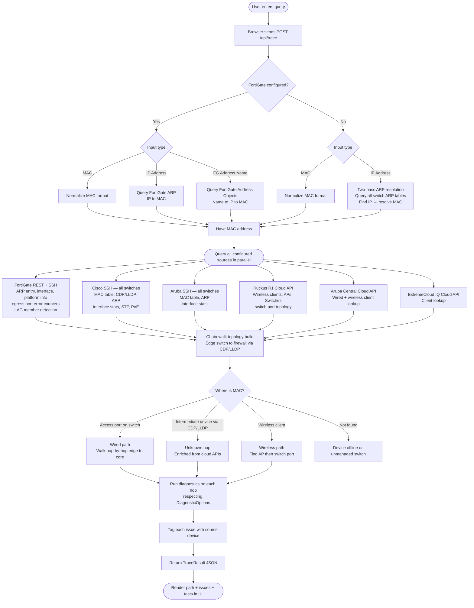
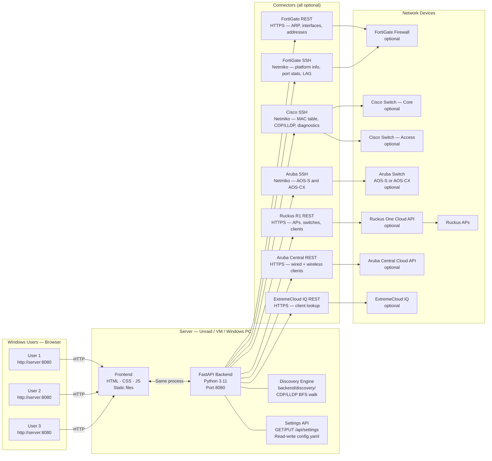
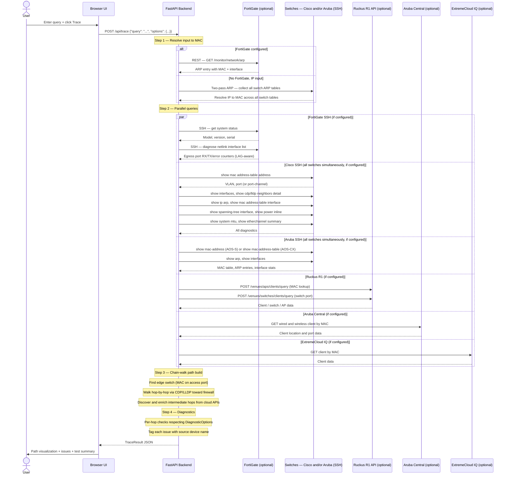

# NetInspect

Vendor-agnostic network troubleshooting platform — configure only the integrations you have. Currently supports: FortiGate, Cisco IOS/IOS-XE/NX-OS, Aruba AOS-S/AOS-CX, Ruckus One, Aruba Central, and ExtremeCloud IQ.

Enter a **MAC address**, **IP address**, or (when FortiGate is configured) a **FortiGate address name** and get a full end-to-end inspection across your firewall, switches, and wireless infrastructure — with automated health checks, diagnostics, and issue detection at every hop.

All integrations are **optional**. Run with only Cisco switches, only Aruba switches, or any combination of supported vendors. The UI adapts automatically to show only the capabilities your config enables.

> **Who uses it:** Anyone on your network opens a browser and goes to `http://<server-ip>:8080`. No install required on user machines.

---

## Table of Contents

1. [What It Does](#1-what-it-does)
2. [How It Works — Application Flow](#2-how-it-works--application-flow)
3. [Architecture Diagram](#3-architecture-diagram)
4. [Network Trace Flow](#4-network-trace-flow)
5. [Supported Checks & Diagnostics](#5-supported-checks--diagnostics)
6. [Deployment Options](#6-deployment-options)
   - [Option A — Windows (local)](#option-a--windows-local)
   - [Option B — Unraid Docker (recommended for shared access)](#option-b--unraid-docker-recommended-for-shared-access)
   - [Option C — Linux VM with Docker](#option-c--linux-vm-with-docker)
   - [Option D — Docker Compose (any platform)](#option-d--docker-compose-any-platform)
7. [Configuration Reference](#7-configuration-reference)
8. [Usage Guide](#8-usage-guide)
9. [Troubleshooting](#9-troubleshooting)
10. [Project Structure](#10-project-structure)
11. [Security Notes](#11-security-notes)
12. [Roadmap](#12-roadmap)

---

## 1. What It Does

| Input | Example | Requires |
|---|---|---|
| MAC Address | `aa:bb:cc:dd:ee:ff` · `aa-bb-cc-dd-ee-ff` · `aabb.ccdd.eeff` | Any switch |
| IP Address | `192.168.1.55` | Any switch (two-pass ARP resolution) |
| FortiGate Address Name | `Server-Web-01` | FortiGate configured |

For any of the above, the tool:

- Resolves the input to both MAC and IP via FortiGate ARP table (if available) or switch ARP tables (two-pass lookup)
- Traces the full network path: **Firewall → Core Switch → Access Switch → AP → Device**
- Handles wired and wireless clients, Port-channel/LAG uplinks, and non-SSH intermediate switches
- Shows device names, vendor/model, IPs, VLANs, and physical port connections at every hop
- Runs **automated diagnostics** on each hop (see [Section 5](#5-supported-checks--diagnostics))
- Flags issues with severity levels: Critical · Warning · Info
- Shows **which device** generated each issue

### Supported Integrations

All integrations are optional. Configure only the ones relevant to your environment.

| Integration | Type | Protocol | Config Key |
|---|---|---|---|
| FortiGate firewall | Firewall | HTTPS REST + SSH | `fortigate` |
| Cisco switches (IOS / IOS-XE / NX-OS) | Wired switch | SSH | `cisco_switches` |
| Aruba switches (AOS-S / AOS-CX) | Wired switch | SSH | `aruba_switches` |
| Ruckus One (R1) | Wireless cloud | HTTPS REST (OAuth2) | `ruckus_r1` |
| Aruba Central | Wireless + wired cloud | HTTPS REST (OAuth2) | `aruba_central` |
| ExtremeCloud IQ | Wireless cloud | HTTPS REST | `extreme_iq` |

---

## 2. How It Works — Application Flow



---

## 3. Architecture Diagram



---

## 4. Network Trace Flow



---

## 5. Supported Checks & Diagnostics

Each check can be individually enabled or disabled from the **Diagnostics options panel** in the UI (gear icon below the search bar).

### Per-hop checks (Cisco switches)

| Check | What it detects | Severity |
|---|---|---|
| **Interface Status** | Port err-disabled, down, inactive | Critical |
| **Duplex** | Half-duplex (causes collisions) | Warning |
| **Speed** | 10 Mbps (negotiation failure) | Warning |
| **Error Counters** | CRC errors, input/output errors, runts, giants | Critical / Warning |
| **MTU** | Non-standard per-interface MTU; shows whether value is global default or per-interface override | Warning |
| **MTU Consistency** | Mismatch across path (causes fragmentation / drops) | Critical |
| **Spanning Tree** | Port in Blocking or transitional state | Warning |
| **PoE Status** | Power denied, fault, or near budget limit (>90%) | Critical / Warning |

### Per-hop checks (Aruba switches)

| Check | What it detects | Severity |
|---|---|---|
| **Interface Status** | Port down or disabled | Critical |
| **Error Counters** | RX/TX errors on the client port | Warning |

### Uplink port counters

For every switch hop, error counters are also collected on the **uplink-facing port** toward upstream devices. This surfaces physical-layer errors on inter-switch links even when the upstream device is not SSH-accessible.

### Port-channel / LAG

When a MAC address is found on a **Port-channel** interface (`Po1`, `lag1`, etc.), the individual member link states are reported — showing which physical ports are bundled, down, or suspended.

#### FortiGate LAG detection

When the FortiGate's egress port is itself a member of a Link Aggregation Group, the tool transparently queries the parent aggregate interface for statistics. The UI displays the connection as **port → aggN (LAG)** in the interface stats section.

### FortiGate egress interface

When SSH credentials are configured for the FortiGate, the egress interface (the port where the traced device's traffic enters the firewall) is checked for RX/TX/error/drop counters via `diagnose netlink interface list`.

### Wireless checks (Ruckus R1 / Aruba Central)

| Check | What it detects | Severity |
|---|---|---|
| **RSSI** | Signal below −75 dBm (poor wireless link) | Warning |

---

## 6. Deployment Options

> **All options result in the same outcome:** a web server on your LAN at `http://<server-ip>:8080`.
> Windows users just open a browser — no install needed on their machines.

---

### Option A — Windows (local)

Run directly on a Windows PC. Suitable for single-user or testing.

#### Prerequisites
- [Python 3.11+](https://www.python.org/downloads/) — check **"Add Python to PATH"** during install

#### Steps

```cmd
:: 1. Clone the repo
git clone https://github.com/ivillagomez/netinspect.git
cd netinspect

:: 2. Install dependencies
pip install -r requirements.txt

:: 3. Create your local config from the example template (never commit config.yaml)
copy config.yaml.example config.yaml
:: Edit config.yaml with Notepad++ or VS Code — fill in your credentials

:: 4. Run the server
python run.py
```

Open: **http://localhost:8080**

To share with others on the LAN: `http://<your-windows-ip>:8080`
Find your IP with `ipconfig` in CMD.

---

### Option B — Unraid Docker (recommended for shared access)

24/7 access for everyone on the LAN.

#### Prerequisites
- Unraid 6.9+ with Docker enabled

#### Steps

```bash
# 1. Open Unraid Terminal (Tools → Terminal) or SSH in

# 2. Clone the repo
cd /mnt/user/appdata
git clone https://github.com/ivillagomez/netinspect.git

# 3. Create and edit your local config from the example template
cd netinspect
cp config.yaml.example config.yaml   # start from the template
nano config.yaml                     # fill in your real credentials
# Ctrl+O → Enter → Ctrl+X to save

# 4. Build the Docker image (~2 min first time)
docker build -t netinspect:latest .

# 5. Start the container
docker run -d \
  --name netinspect \
  --restart unless-stopped \
  -p 8080:8080 \
  -v /mnt/user/appdata/netinspect/config.yaml:/app/config.yaml:ro \
  netinspect:latest

# 6. Verify it's running
docker ps | grep netinspect
```

Open from any LAN machine: **http://\<unraid-ip\>:8080**

#### Managing via Unraid Docker UI

After the image is built, you can manage it through the Unraid web UI (Docker tab → Add Container):

| Field | Value |
|---|---|
| Name | `netinspect` |
| Repository | `netinspect:latest` |
| Network Type | `Bridge` |
| Port | Host `8080` → Container `8080` |
| Path | Host `/mnt/user/appdata/netinspect/config.yaml` → Container `/app/config.yaml` · Read Only |
| Restart Policy | `Unless Stopped` |

#### Updating config later

```bash
nano /mnt/user/appdata/netinspect/config.yaml
docker restart netinspect
```

---

### Option C — Linux VM with Docker

```bash
# 1. Install Docker
curl -fsSL https://get.docker.com | sh

# 2. Clone + configure
git clone https://github.com/ivillagomez/netinspect.git
cd netinspect
cp config.yaml.example config.yaml
nano config.yaml    # fill in credentials

# 3. Build and run
docker build -t netinspect:latest .
docker run -d \
  --name netinspect \
  --restart unless-stopped \
  -p 8080:8080 \
  -v $(pwd)/config.yaml:/app/config.yaml:ro \
  netinspect:latest
```

---

### Option D — Docker Compose (any platform)

```bash
git clone https://github.com/ivillagomez/netinspect.git
cd netinspect
cp config.yaml.example config.yaml
nano config.yaml         # fill in credentials

docker compose up -d --build     # start
docker compose down              # stop
```

---

## 7. Configuration Reference

`config.yaml` lives in the project root and is **excluded from git** (see [Section 11](#11-security-notes)).
Copy `config.yaml.example` (included in the repo) to `config.yaml` and remove or comment out any sections you do not need.

All top-level sections except `server` are optional. The tool will start and function correctly with only the sections relevant to your environment.

```yaml
# ── Global Switch Credentials (optional) ─────────────────────────────────────
# Shared TACACS username/password used by all SSH switches that do not have
# their own username/password set. Omit per-switch credentials to inherit these.
switch_credentials:
  username: "svc-netinspect"
  password: "YOUR_TACACS_PASSWORD"
  device_type: "cisco_ios"   # default Netmiko driver for discovered switches
  timeout: 30

# ── FortiGate (optional) ─────────────────────────────────────────────────────
# Remove this entire section if you have no FortiGate firewall.
# Without FortiGate, only MAC address and IP address inputs are supported.
fortigate:
  host: "192.168.1.1"
  port: 443
  access_token: "YOUR_API_TOKEN"
  verify_ssl: false
  ssh_username: "YOUR_SSH_USERNAME"
  ssh_password: "YOUR_SSH_PASSWORD"
  ssh_port: 22

# ── Cisco Switches (optional) ─────────────────────────────────────────────────
# username/password are optional per switch — omit to use switch_credentials
cisco_switches:
  - name: "SW-Core"
    host: "192.168.1.x"
    # username: "YOUR_SSH_USERNAME"   # omit to inherit from switch_credentials
    # password: "YOUR_SSH_PASSWORD"   # omit to inherit from switch_credentials
    device_type: "cisco_ios"
    timeout: 30
    # snmp_community: "public"   # optional SNMP fast-path

# ── Aruba Switches (optional) ─────────────────────────────────────────────────
# username/password are optional per switch — omit to use switch_credentials
aruba_switches:
  - name: "Aruba-Core"
    host: "192.168.1.x"
    # username: "YOUR_SSH_USERNAME"   # omit to inherit from switch_credentials
    # password: "YOUR_SSH_PASSWORD"   # omit to inherit from switch_credentials
    os_type: "aruba_os"     # "aruba_os" (2930/2930F/2930M) or "aruba_osix" (6000/6100)
    timeout: 30

# ── Ruckus One (optional) ─────────────────────────────────────────────────────
ruckus_r1:
  base_url: "https://api.asia.ruckus.cloud"
  client_id: "YOUR_CLIENT_ID"
  client_secret: "YOUR_CLIENT_SECRET"
  tenant_id: "YOUR_TENANT_ID"

# ── Aruba Central (optional) ──────────────────────────────────────────────────
aruba_central:
  base_url: "https://apigw-prod2.central.arubanetworks.com"
  client_id: "YOUR_CLIENT_ID"
  client_secret: "YOUR_CLIENT_SECRET"
  customer_id: "YOUR_CUSTOMER_ID"

# ── ExtremeCloud IQ (optional) ────────────────────────────────────────────────
extreme_iq:
  base_url: "https://extremecloudiq.com"
  api_key: "YOUR_API_KEY"

# ── Web Server ────────────────────────────────────────────────────────────────
server:
  host: "0.0.0.0"
  port: 8080
  api_key: ""             # optional: require X-API-Key header on all API calls
  allowed_origins: []     # blank = allow all; restrict for non-LAN deployments
```

---

### Global switch credentials (`switch_credentials`)

The `switch_credentials` section defines a single TACACS username and password shared across all SSH switches. Any switch in `cisco_switches` or `aruba_switches` that does **not** have its own `username` and `password` fields set will use these credentials at runtime.

Per-switch `username` and `password` fields are optional. When set, they take priority over `switch_credentials`. When omitted, they are never written into the switch entry — the global fallback is applied at connection time.

This is the recommended pattern when all switches share a single TACACS service account.

### Cisco switches — `device_type` values

| Cisco Platform | device_type |
|---|---|
| Catalyst 2960, 3650, 3850, 9200, 9300 | `cisco_ios` |
| Catalyst 9000 with IOS-XE | `cisco_xe` |
| Nexus switches | `cisco_nxos` |

### Aruba switches — `os_type` values

| Aruba Series | os_type |
|---|---|
| 2930F, 2930M (ArubaOS-S) | `aruba_os` |
| 6000, 6100 (ArubaOS-CX) | `aruba_osix` |

### Cisco SNMP fast-path (optional)

When `snmp_community` is set on a Cisco switch entry, the tool uses SNMP (via puresnmp) to collect MAC table entries and IF-MIB interface statistics concurrently with SSH, reducing overall trace time on larger environments. Omit this field to use SSH only.

```yaml
cisco_switches:
  - name: "SW-Core"
    host: "192.168.1.x"
    device_type: "cisco_ios"
    timeout: 30
    snmp_community: "public"    # enables SNMP fast-path
    snmp_port: 161              # default: 161
    snmp_version: "2c"          # "1" or "2c"
```

### FortiGate API token

1. Log in to FortiGate web UI
2. Go to **System → Administrators → Create New → REST API Admin**
3. Name it `netinspect`, PKI Group: none
4. Under **Trusted Hosts**, add the IP of the machine running this tool (or `0.0.0.0/0` for any)
5. Copy the generated token → paste as `access_token`

> The token only needs **read-only** access. Restrict to: Monitor, Network, Firewall.

### FortiGate SSH

When `ssh_username` and `ssh_password` are set, the tool also connects via SSH to retrieve:
- Device model, version, and serial number (`get system status`)
- RX/TX/error/drop counters on the egress interface — including LAG parent aggregates (`diagnose netlink interface list`)

If left blank, the tool falls back to REST API data (less detail, no error counters).

### Ruckus R1 credentials

1. Log in to the Ruckus One portal (`asia.ruckus.cloud` or your regional URL)
2. Go to **Administration → Settings → Application Tokens**
3. Create a new token → copy the **Client ID** and **Client Secret**
4. Your **Tenant ID** is in the portal URL after login: `asia.ruckus.cloud/<tenantId>/...`
5. Set `base_url` to `https://api.asia.ruckus.cloud` (or your region's API domain)

> The tool uses the OAuth2 Client Credentials flow — tokens are fetched automatically and cached for ~2 hours.

### Aruba Central credentials

1. Log in to Aruba Central (`central.arubanetworks.com` or your regional URL)
2. Go to **Account Home → API Gateway → System Apps & Tokens**
3. Create a new token → copy the **Client ID** and **Client Secret**
4. Your **Customer ID** is visible in the portal URL after login, or under **Account Settings → Customer ID**
5. Set `base_url` to `https://apigw-prod2.central.arubanetworks.com` (US) or your regional endpoint

> The tool uses the OAuth2 Client Credentials flow — tokens are fetched and refreshed automatically.

### ExtremeCloud IQ credentials

1. Log in to ExtremeCloud IQ (`extremecloudiq.com`)
2. Go to **Global Settings → API Token Management**
3. Generate a new API Key → copy it as `api_key`
4. Alternatively, use OAuth2 client credentials if your organization uses SSO integration

> Tokens can expire — regenerate in Global Settings → API Token Management if the integration stops returning data.

---

## 8. Usage Guide

### Searching

Type any of the following in the search bar and press **Enter** or click **Trace**:

```
aa:bb:cc:dd:ee:ff       MAC — colon-separated
aa-bb-cc-dd-ee-ff       MAC — dash-separated
aabb.ccdd.eeff          MAC — Cisco/Ruckus dotted format
192.168.1.55            IP address
Server-Web-01           FortiGate address object name (only when FortiGate is configured)
```

The search bar placeholder dynamically reflects your configuration:
- When FortiGate is configured: `MAC, IP, or FortiGate address name`
- Without FortiGate: `MAC or IP address`

Results appear in 5–20 seconds depending on the number of switches and their response times.

### IP address lookup without FortiGate

When no FortiGate is configured and an IP address is entered, the tool performs a **two-pass ARP resolution**:

1. All configured switches are queried with an empty MAC to collect their full ARP tables
2. The ARP tables are searched for the entered IP to resolve it to a MAC address
3. All switches are re-queried with the discovered MAC to locate the device
4. If no switch ARP table contains the IP, the result is "not found"

### Vendor chips in the header

The header shows chips for each configured integration (FortiGate, Cisco, Aruba, Ruckus, etc.). If an integration is not configured, its chip does not appear. This lets users immediately see which data sources are active.

### Diagnostic options

Click the **gear icon** below the search bar to expand the diagnostics panel. Toggle individual checks on or off before running a trace:

| Option | What it runs |
|---|---|
| **Interface Status** | Port up/down, duplex, speed |
| **Error Counters** | CRC, input/output errors, runts, giants |
| **MTU Check** | Per-interface MTU vs. global; cross-hop consistency |
| **Spanning Tree** | Role and state per port |
| **PoE Status** | Power delivery and budget |
| **Neighbor Info** | Per-port CDP/LLDP connected device name and port |
| **System Logs** | Recent error/warning syslog entries (`show logging`) |

Disabling options speeds up traces and reduces SSH commands on the switches.

### Settings UI

Click the **gear icon in the footer** to open the Settings modal. Settings are organized into accordion sections:

| Section | What you can configure |
|---|---|
| **Switch Authentication** | Global TACACS username and password (`switch_credentials`) shared across all SSH switches |
| **Discover from Seed** | Start a CDP/LLDP BFS walk from a seed IP to automatically find switches |
| **Cisco Switches** | Add, edit, or remove Cisco switch inventory rows |
| **Aruba Switches** | Add, edit, or remove Aruba switch inventory rows |
| **FortiGate** | Host, API token, optional SSH credentials |
| **Cloud APIs** | Ruckus One, Aruba Central, and ExtremeCloud IQ credentials |
| **Server** | Port, optional API key, allowed CORS origins |

Click **Save** to write all changes back to `config.yaml` via `PUT /api/settings`. Masked credential fields (shown as `••••••••`) are preserved from disk when saved — they are never overwritten with the masked placeholder.

#### CDP/LLDP Auto-Discovery workflow

1. Open Settings → **Discover from Seed**
2. Enter a seed IP (typically your core switch), scope CIDR (e.g. `10.0.0.0/8`), and max depth
3. Click **Start Discovery** — the panel streams live progress with depth-indented device names
4. Use the **Stop** button to cancel at any time
5. Discovered devices appear in a checklist — select the ones you want and click **Add selected to inventory**
6. Selected switches are added to the Cisco or Aruba switch lists without duplicates
7. Click **Save** to write the updated inventory to `config.yaml`

The discovery engine walks CDP neighbors first, falls back to LLDP, and skips access points, routers, and firewalls from recursion. It uses `switch_credentials` for all SSH connections during the walk.

### Reading results

**Path visualization** — left to right: Firewall → switches → (AP) → device
- Click any node to jump to its detail card
- Port labels between nodes show the physical connection (e.g. `Gi1/0/24 → Gi0/1`)
- When a FortiGate port is a LAG member, the label shows `port → aggN (LAG)`
- Issue dot on a node = problems found (red = critical, amber = warning)

**Issues Found** — each issue shows:
- Severity badge (Critical / Warning / Info)
- **Device name** where the issue was found
- Message and detail with recommended action

**Diagnostic Tests** — pass/fail/warning summary across all hops; individual results visible per hop card when expanded.

**Hop detail cards** — expand any card for:
- Vendor, model, software version, IP
- Ingress and egress physical ports
- Interface status, error counters, MTU context
- CDP/LLDP neighbor, STP state, PoE power
- Port-channel member link states
- Uplink port error counters
- FortiGate egress interface statistics (when SSH configured)
- Ruckus AP wired uplink shown as ETH0 when no explicit port is returned

### Dark/light theme

Click the **sun/moon button in the footer** to toggle between dark and light themes. The selected theme persists across sessions via `localStorage`.

### Version display

The footer displays the current application version, read at runtime from `GET /api/ui-config`. The `VERSION` file at the project root is the single source of truth for the version number.

---

## 9. Troubleshooting

### "Could not resolve to a MAC address"
- Device may be offline — no ARP entry on any configured device
- If using an IP without FortiGate: ping the device first to refresh ARP caches, then trace
- If using a FortiGate address name: check the name is exact and matches the address object in FortiGate

### "Device not located on any switch"
- Device may be behind an **unmanaged switch** not in the tool's list
- MAC may have aged out: check `show mac address-table aging-time` on Cisco switches
- Device may be on a VLAN not trunked to any configured switch

### Cisco switch shows as "Unreachable"
- Verify SSH is enabled: `show ip ssh` on the switch
- Test connectivity from the server: `ssh <username>@<switch-ip>`
- Check no ACL is blocking SSH from the tool's IP
- Confirm credentials in `config.yaml` are correct (or that `switch_credentials` is set if per-switch credentials are omitted)

### Aruba switch shows as "Unreachable"
- Confirm `os_type` is correct for your switch series (`aruba_os` for 2930/2930F/2930M, `aruba_osix` for 6000/6100)
- Test SSH from the server: `ssh <username>@<switch-ip>`
- Verify the account has read access to run `show` commands

### FortiGate API errors
- Verify `access_token` is correct and not expired
- Confirm the token's trusted host includes the tool server's IP
- `verify_ssl: false` is required for self-signed certificates

### FortiGate SSH not working
- Confirm `ssh_username` and `ssh_password` are set in `config.yaml`
- Test manually: `ssh <username>@<fortigate-ip>`
- If SSH works but model info is missing, check logs — `get system status` output format may vary by firmware version

### FortiGate shows LAG port as "unknown"
- Confirm the FortiGate SSH credentials are configured — LAG parent lookup requires SSH (`diagnose netlink interface list`)
- The REST API alone does not expose LAG membership

### Ruckus R1 returns no data
- Confirm `client_id` and `client_secret` are correct — generate them in Ruckus One portal under **Administration → Settings → Application Tokens**
- Confirm `tenant_id` is set — find it in the portal URL after login: `asia.ruckus.cloud/<tenantId>/...`
- Verify `base_url` matches your region: `https://api.asia.ruckus.cloud` / `https://api.eu.ruckus.cloud` / `https://api.ruckus.cloud`
- Token exchange uses `https://asia.ruckus.cloud/oauth2/token/<tenantId>` (not the `api.*` subdomain)

### Ruckus AP shows no wired uplink port
- The wired uplink port is shown as `ETH0` (the universal Ruckus AP port) when the R1 API does not return an explicit port field. This is expected behavior.

### Ruckus AP shows no firmware version
- Firmware is read from multiple field variants (`firmware`, `firmwareVersion`, `swVersion`). If still missing, the AP data returned by R1 may not include firmware for that AP model.

### Aruba Central returns no data
- Verify `client_id`, `client_secret`, and `customer_id` are all correct — check that the API token has read access to device inventory and clients
- Confirm `base_url` matches your Aruba Central regional gateway (e.g. `https://apigw-prod2.central.arubanetworks.com` for US)
- Regenerate the token in **Account Home → API Gateway → System Apps & Tokens** if credentials have changed

### ExtremeCloud IQ returns no data
- Verify the `api_key` is correct — tokens can expire, regenerate from **Global Settings → API Token Management** if needed
- Ensure the account has Operator role or higher (read-only accounts with insufficient permissions will return empty results)
- Confirm `base_url` is `https://extremecloudiq.com` (or your regional endpoint if applicable)

### Settings not saving
- Verify `PUT /api/settings` is reachable — if `server.api_key` is set, include the `X-API-Key` header in the Settings UI
- Check that the process has write permission to `config.yaml`
- If running in Docker with `config.yaml` mounted as read-only (`:ro`), remove the read-only flag: use `-v .../config.yaml:/app/config.yaml` without `:ro`

### Port 8080 already in use
Edit `config.yaml`, change `server.port` to another value (e.g. `8090`), restart.

---

## 10. Project Structure

```
netinspect/
│
├── VERSION                      ← Single source of truth for version number (e.g. 1.1.0)
├── config.yaml                  ← Your credentials — gitignored, never committed
├── config.yaml.example          ← Template with all sections; copy to config.yaml
├── run.py                       ← Entry point: starts the uvicorn server
├── requirements.txt             ← Python dependencies
├── Dockerfile                   ← Container image definition
├── docker-compose.yml           ← Docker Compose deployment
│
├── backend/
│   ├── main.py                  ← FastAPI app + routes + security headers middleware
│   ├── config.py                ← Config loader (YAML → Pydantic models)
│   ├── models.py                ← Pydantic data models (Hop, Issue, TraceResult…)
│   │
│   ├── connectors/
│   │   ├── fortigate.py         ← FortiGate REST API: ARP table, address objects, interfaces
│   │   ├── fortigate_ssh.py     ← FortiGate SSH: platform info, egress port counters, LAG detection
│   │   ├── cisco_ssh.py         ← Cisco SSH: MAC table, CDP/LLDP, ARP, STP, PoE, etherchannel
│   │   ├── cisco_snmp.py        ← Optional SNMP fast path: MAC table + IF-MIB stats (puresnmp)
│   │   ├── aruba_ssh.py         ← Aruba SSH: AOS-S (2930/2930F/2930M) and AOS-CX (6000/6100)
│   │   ├── aruba_central.py     ← Aruba Central cloud API: wired + wireless client lookup
│   │   ├── extreme_iq.py        ← ExtremeCloud IQ cloud API: client lookup
│   │   └── ruckus_r1.py         ← Ruckus One REST: APs, managed switches, wireless clients (OAuth2)
│   │
│   ├── discovery/
│   │   ├── __init__.py          ← Package init
│   │   └── cdp_lldp.py          ← CDP/LLDP BFS discovery engine; streams DiscoveryEvent SSE objects
│   │
│   └── tracer/
│       ├── resolver.py          ← Parses MAC / IP / FortiGate address name input
│       ├── mac_tracer.py        ← Core engine: chain-walk topology + path building
│       └── diagnostics.py       ← Per-hop health checks returning (issues, tests) tuples
│
└── frontend/
    ├── index.html               ← Single-page app shell + diagnostics options panel + settings modal
    ├── css/style.css            ← Dark/light glassmorphism theme
    └── js/app.js                ← UI: capabilities check, trace, path render, hop cards, tests summary,
                                    settings modal, discovery workflow, theme toggle
```

### API endpoints

| Endpoint | Auth | Description |
|---|---|---|
| `GET /api/health` | None | `{"status": "ok"}` |
| `GET /api/capabilities` | None | Which integrations are configured; used at page load to adapt the UI |
| `GET /api/ui-config` | None | `{"version": "1.1.0", "api_key_required": bool}`; footer reads this at runtime |
| `GET /api/settings` | Optional API key | Full config with secrets masked as `••••••••` |
| `PUT /api/settings` | Optional API key | Save updated config; masked values are preserved from disk |
| `POST /api/discover` | Optional API key | SSE stream of CDP/LLDP BFS discovery events from a seed IP |
| `POST /api/trace` | Optional API key | Run a full network path trace. Body: `{"query": "...", "options": {...}}` |
| `GET /api/devices` | Optional API key | Configured device names for status overview |

The `/api/capabilities` response shape:

```json
{
  "fortigate": true,
  "cisco_switches": 3,
  "aruba_switches": 1,
  "ruckus_r1": false,
  "aruba_central": false,
  "extreme_iq": false
}
```

### Data flow

```
User Query (MAC / IP / FG name)
    ↓
resolver.py          Normalizes input → MAC + IP (two-pass ARP if no FortiGate + IP input)

mac_tracer.py        Orchestrates parallel queries:
    ├── fortigate.py + fortigate_ssh.py   ARP entry, egress interface, FG platform, LAG
    ├── cisco_ssh.py (all switches)        MAC table, CDP/LLDP, diagnostics, ARP
    ├── cisco_snmp.py (optional)           Concurrent SNMP: MAC + interface stats
    ├── aruba_ssh.py (all switches)        MAC table, ARP, interface stats
    ├── ruckus_r1.py                       Wireless clients, AP info, switch ports (OAuth2)
    ├── aruba_central.py                   Wired + wireless client lookup (OAuth2)
    └── extreme_iq.py                      Client lookup (API key)

mac_tracer.py        Chain-walk: edge switch → upstream via CDP/LLDP
                     Unknown hops enriched from cloud APIs
                     Port connections tracked at every hop

diagnostics.py       Per-hop checks gated by DiagnosticOptions
                     Issues tagged with source device name

TraceResult JSON     Returned to frontend

app.js               Reads /api/capabilities at load, adapts UI
                     Reads /api/ui-config for version display
                     Renders path nodes, hop cards, issues panel, test summary
                     Settings modal reads GET /api/settings, writes PUT /api/settings
                     Discovery workflow streams POST /api/discover SSE events
```

---

## 11. Security Notes

### config.yaml is gitignored

`config.yaml` is listed in `.gitignore` and **must never be committed with real credentials**.
The `config.yaml.example` file in the repository contains only placeholder values.

When deploying:
1. Clone the repo
2. Copy `config.yaml.example` to `config.yaml`
3. Edit `config.yaml` locally with your real credentials
4. It will not be tracked by git

### Credential exposure in git history

> **Action required if making this repository public.**

If earlier development commits included real credentials before `.gitignore` was applied, and you intend to make this repo public or share it outside your organization:

1. **Rotate all credentials immediately:**
   - Generate a new FortiGate API token (System → Administrators)
   - Change the FortiGate SSH password
   - Change all switch SSH passwords (Cisco and Aruba)
   - Regenerate the Ruckus R1, Aruba Central, and ExtremeCloud IQ API keys

2. **Clean git history** with [BFG Repo Cleaner](https://rtyley.github.io/bfg-repo-cleaner/) or `git filter-repo`:
   ```bash
   # Using BFG (recommended)
   bfg --replace-text passwords.txt netinspect.git
   git reflog expire --expire=now --all
   git gc --prune=now --aggressive
   git push --force
   ```

3. If the repo stays **private and internal**, rotating credentials is still recommended as a precaution.

### Optional API key for the web UI

Set `server.api_key` in `config.yaml` to require an `X-API-Key` header on all backend API calls. Useful when the tool is exposed beyond a trusted LAN segment. The `/api/capabilities`, `/api/health`, and `/api/ui-config` endpoints are always unauthenticated (they contain no credentials or sensitive data).

### Security hardening (v1.1.0)

The following security controls are active by default:

- **XSS prevention** — all dynamic HTML rendered via `esc()` escaping in the frontend
- **Constant-time API key comparison** — `hmac.compare_digest` prevents timing-based key enumeration
- **SSH injection prevention** — `_safe_port()` validates port values in all SSH connectors
- **Masked secrets in Settings API** — credentials are returned as `••••••••` and masked values are never written back to disk
- **Generic error messages** — exception handlers return generic messages with no credential context
- **Security response headers** — `X-Content-Type-Options`, `X-Frame-Options`, `Referrer-Policy`, and `Content-Security-Policy` set on all responses via middleware
- **CORS lockdown** — set `server.allowed_origins` in `config.yaml` to restrict cross-origin access for non-LAN deployments; blank allows all origins
- **`verify_ssl: false` warning** — logged at startup when SSL verification is disabled for FortiGate

### MFA / TACACS

Automated SSH via Netmiko is incompatible with interactive MFA (Duo push, TOTP, RSA token). MFA requires a human to respond mid-handshake; automated sessions hang waiting for a second factor.

**Recommended approach:** Create a dedicated service account (`svc-netinspect`) in your TACACS server that is MFA-exempt. Apply the following compensating controls:

- Read-only privilege level (`privilege 1` on Cisco, Operator on Aruba) — `show` commands only, no `configure terminal`
- Source IP restriction to the NetInspect server only
- Session logging enabled in TACACS for all connections from this account
- Quarterly access review

This is standard practice for all network automation tools (Ansible, NSO, SolarWinds, PRTG). The `switch_credentials` section in `config.yaml` is designed for exactly this service account pattern — one set of credentials shared across all switches.

If your organization cannot exempt any account from MFA, alternatives include SNMP v3 for counters and status (already partially implemented via the optional SNMP fast-path) or per-switch REST APIs on modern IOS-XE and Aruba CX platforms.

### Minimum required permissions

| Device | Required access |
|---|---|
| FortiGate REST API | Read-only: Monitor, Network, Firewall |
| FortiGate SSH | Read-only admin (no config write needed) |
| Cisco switches | Read-only SSH user (`privilege 1` is sufficient) |
| Aruba switches (AOS-S) | Operator-level account (read-only show commands) |
| Aruba switches (AOS-CX) | Read-only role |
| Ruckus R1 | Read-only API token scoped to your venues |
| Aruba Central | Read-only API token (client and device read) |
| ExtremeCloud IQ | Read-only API key |

### Network access

The server running NetInspect needs:
- HTTPS outbound to FortiGate (port 443) — if configured
- SSH outbound to all Cisco and Aruba switches (port 22) — for configured switches
- HTTPS outbound to `api.asia.ruckus.cloud` (or your regional endpoint) — if Ruckus R1 configured
- HTTPS outbound to your Aruba Central gateway — if Aruba Central configured
- HTTPS outbound to `extremecloudiq.com` — if ExtremeCloud IQ configured

No inbound ports are needed other than `8080` for the web UI.

---

## 12. Roadmap

| Feature | Status |
|---|---|
| FortiGate + Cisco + Ruckus R1 path trace | Done |
| Chain-walk topology (handles non-SSH intermediate switches) | Done |
| Vendor / model / software version per hop | Done |
| MTU / duplex / error / STP / PoE diagnostics | Done |
| Selectable diagnostic options per trace | Done |
| Per-test pass/fail summary panel | Done |
| Physical port connections between hops | Done |
| FortiGate SSH egress interface stats | Done |
| FortiGate LAG (aggregate) member detection | Done |
| Port-channel / LAG member link status (Cisco) | Done |
| Ruckus switch port enrichment from R1 | Done |
| Ruckus AP ETH0 uplink fallback + firmware field variants | Done |
| `show ip arp` + `show mac address-table` for richer discovery | Done |
| Issues panel with source device attribution | Done |
| Docker / Unraid deployment | Done |
| Optional SNMP fast path for Cisco switches (MAC + IF-MIB stats) | Done |
| Aruba switch support — AOS-S (2930/2930F/2930M) and AOS-CX (6000/6100) | Done |
| Aruba Central cloud API integration (wired + wireless) | Done |
| ExtremeCloud IQ cloud API integration | Done |
| Fully modular / vendor-agnostic config (all sections optional) | Done |
| Two-pass ARP resolution from switches (no FortiGate required) | Done |
| /api/capabilities endpoint for UI adaptation | Done |
| Dark/light theme toggle with localStorage persistence | Done |
| System Logs diagnostic option (`show logging`) | Done |
| Dynamic versioning via VERSION file + /api/ui-config | Done |
| Web-based Settings UI (gear icon, accordion sections, save to config.yaml) | Done |
| Global switch credentials (`switch_credentials`) with per-switch override | Done |
| CDP/LLDP Auto-Discovery (BFS walk, SSE progress stream, add to inventory) | Done |
| Security hardening (XSS, timing-safe key compare, SSH injection, CSP headers) | Done |
| Export trace to PDF / CSV | Planned |
| Saved trace history / comparison | Planned |
| FortiAnalyzer log correlation | Planned |
| Email / Teams alert on critical issues | Planned |
| Palo Alto firewall support | Planned |
| RESTCONF / NETCONF device API support (alternative to SSH for modern IOS-XE / Aruba CX) | Planned |
| SSH connection pooling (reuse connections across concurrent traces) | Planned |
