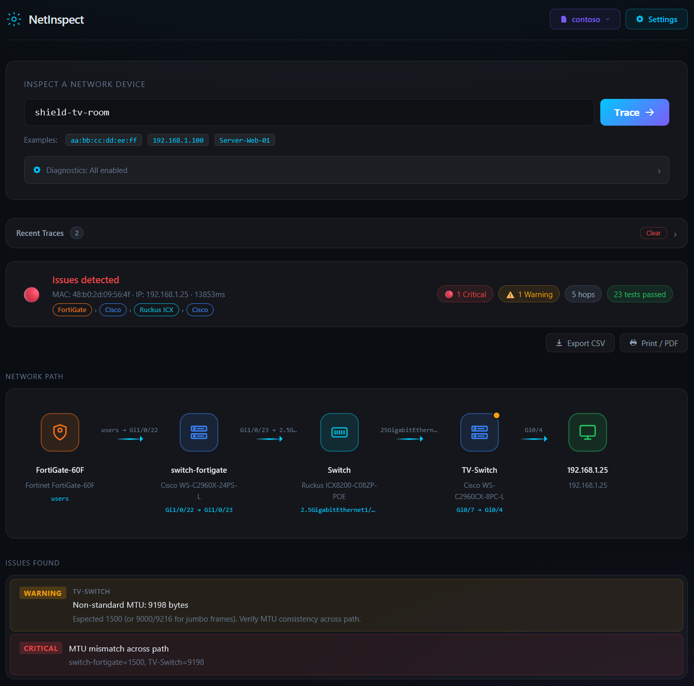

# NetInspect

[](LICENSE)
[](https://github.com/ivillagomez/netinspect/pkgs/container/netinspect)
[](https://buymeacoffee.com/ivillagomez)

Vendor-agnostic network path tracer and diagnostics platform. Enter a **MAC address**, **IP address**, or **FortiGate address object name** and get full end-to-end inspection across your firewall, switches, and wireless infrastructure — in your browser, no client install required.



---

## Quick Start

### Docker _(no clone required)_

```bash
docker run -d -p 8080:8080 -v netinspect_data:/app/data \
  -e NETWORK_TRACER_CONFIG=/app/data/config.yaml \
  --name netinspect ghcr.io/ivillagomez/netinspect:latest
```

### Docker Compose _(recommended for persistent deployments)_

```bash
git clone https://github.com/ivillagomez/netinspect.git
cd netinspect
docker compose up -d --build
```

### Python (Windows / Linux)

```cmd
git clone https://github.com/ivillagomez/netinspect.git
cd netinspect
pip install -r requirements.txt
python run.py
```

Open **http://localhost:8080** → click **Settings** (top right) → add your devices → **Save**.

> See [Deployment options](docs/deployment.md) for Unraid, Linux VM, and other setups.

---

## What It Does

- Resolves MAC / IP / FortiGate address name → full network path in a single query
- Traces **Firewall → Core Switch → Access Switch → AP → Device**, hop by hop
- Automated diagnostics: MTU, duplex, error counters, STP state, PoE, system logs
- Flags issues with **Critical / Warning** severity and pinpoints the source device
- All integrations are **optional** — configure only the vendors you have

---

## Supported Integrations

| Integration | Type | Protocol |
|---|---|---|
| **FortiGate** | Firewall | HTTPS REST + SSH |
| **Cisco** IOS / IOS-XE / NX-OS | Switch | SSH · SNMP (optional) · RESTCONF (optional) |
| **Aruba** AOS-S / AOS-CX | Switch | SSH · REST API (optional) |
| **Ruckus One** | Wireless cloud | HTTPS REST (OAuth2) |
| **Aruba Central** | Wireless + wired cloud | HTTPS REST (OAuth2) |
| **ExtremeCloud IQ** | Wireless cloud | HTTPS REST |

---

## Documentation

Full documentation is available in the **[Wiki](https://github.com/ivillagomez/netinspect/wiki)** — including architecture diagrams, sequence flows, configuration reference, and troubleshooting guides.

Quick links:

| Topic | Wiki | In-repo |
|---|---|---|
| Deployment | [Wiki](https://github.com/ivillagomez/netinspect/wiki/Deployment) | [docs/deployment.md](docs/deployment.md) |
| Configuration | [Wiki](https://github.com/ivillagomez/netinspect/wiki/Configuration) | [docs/configuration.md](docs/configuration.md) |
| Usage guide | [Wiki](https://github.com/ivillagomez/netinspect/wiki/Usage-Guide) | [docs/usage.md](docs/usage.md) |
| Architecture & diagrams | [Wiki](https://github.com/ivillagomez/netinspect/wiki/Architecture) | [docs/architecture.md](docs/architecture.md) |
| Troubleshooting | [Wiki](https://github.com/ivillagomez/netinspect/wiki/Troubleshooting) | [docs/troubleshooting.md](docs/troubleshooting.md) |
| Security | [Wiki](https://github.com/ivillagomez/netinspect/wiki/Security) | [docs/security.md](docs/security.md) |
| Roadmap | [Wiki](https://github.com/ivillagomez/netinspect/wiki/Roadmap) | [docs/roadmap.md](docs/roadmap.md) |

---

## Support

If NetInspect saves you time, consider buying me a coffee ☕

[](https://buymeacoffee.com/ivillagomez)

---

## License

[MIT](LICENSE) — © 2026 ivillagomez
