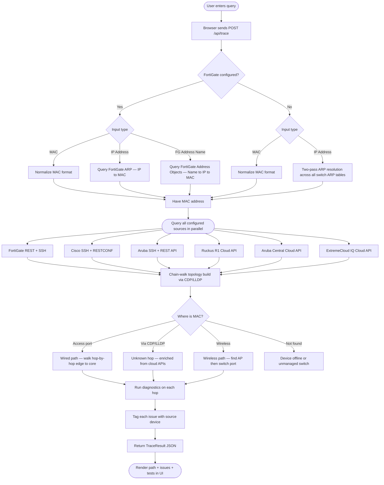
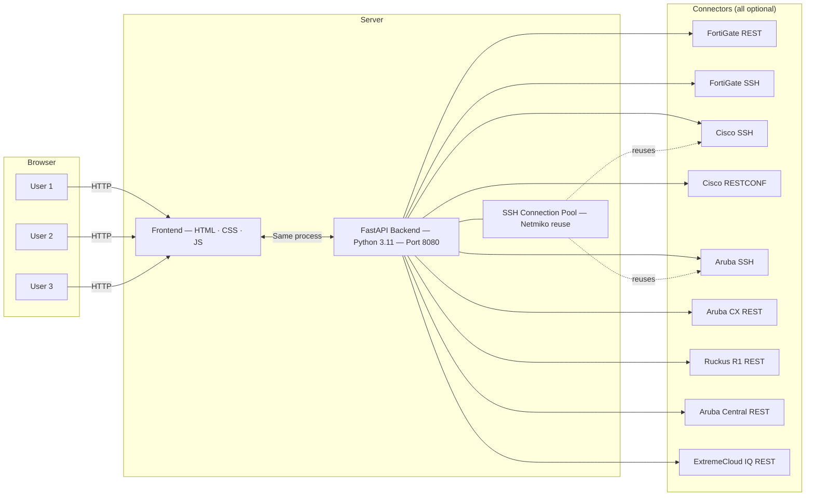

# Architecture & API Reference

## Application Flow



---

## Architecture Diagram



---

## API Endpoints

| Endpoint | Auth | Description |
|---|---|---|
| `GET /api/health` | None | `{"status": "ok"}` |
| `GET /api/capabilities` | None | Which integrations are configured; used at page load to adapt the UI |
| `GET /api/ui-config` | None | `{"version": "1.2.0", "api_key_required": bool}` |
| `GET /api/settings` | Optional API key | Full config with secrets masked as `••••••••` |
| `PUT /api/settings` | Optional API key | Save updated config; masked values preserved from disk; 64 KB body limit |
| `POST /api/discover` | Optional API key | SSE stream of CDP/LLDP BFS discovery events; rate limited 10/min |
| `POST /api/trace` | Optional API key | Run a full network path trace; rate limited 30/min per IP |
| `GET /api/devices` | Optional API key | Configured device names for status overview |

### `/api/capabilities` response shape

```json
{
  "fortigate": true,
  "cisco_switches": 3,
  "aruba_switches": 1,
  "ruckus_r1": false,
  "aruba_central": false,
  "extreme_iq": false
}
```

---

## SSH Connection Pool

| Parameter | Value | Description |
|---|---|---|
| Max pooled per switch | 2 | Maximum concurrent connections per `(host, user, driver)` key |
| Idle timeout | 300 s | Connections idle longer than this are closed automatically |
| Wait timeout | 30 s | Max time to wait for a free slot before creating a temporary over-limit connection |
| Liveness check | Paramiko transport | Dead connections are detected and replaced before reuse |
| Shutdown | Graceful | All pooled connections are closed on app shutdown |

---

## Project Structure

```
netinspect/
│
├── VERSION                      ← Single source of truth for version number
├── config.yaml                  ← Your credentials — gitignored, never committed
├── config.yaml.example          ← Template; copy to config.yaml to get started
├── run.py                       ← Entry point: starts the uvicorn server
├── requirements.txt             ← Python dependencies
├── Dockerfile                   ← Container image definition
├── docker-compose.yml           ← Docker Compose deployment
│
├── backend/
│   ├── main.py                  ← FastAPI app + routes + rate limiting + CSP middleware
│   ├── config.py                ← Config loader (YAML → Pydantic models)
│   ├── models.py                ← Pydantic data models (Hop, Issue, TraceResult…)
│   │
│   ├── connectors/
│   │   ├── fortigate.py         ← FortiGate REST API: ARP table, address objects, interfaces
│   │   ├── fortigate_ssh.py     ← FortiGate SSH: platform info, egress port counters, LAG
│   │   ├── cisco_ssh.py         ← Cisco SSH: MAC table, CDP/LLDP, ARP, STP, PoE, etherchannel
│   │   ├── cisco_snmp.py        ← Optional SNMP fast path: MAC table + IF-MIB stats
│   │   ├── cisco_restconf.py    ← Cisco RESTCONF: YANG-based MAC/ARP/CDP/LLDP/interface queries
│   │   ├── aruba_ssh.py         ← Aruba SSH: AOS-S (2930/2930F/2930M) and AOS-CX (6000/6100)
│   │   ├── aruba_cx_rest.py     ← Aruba CX REST API: MAC/ARP/LLDP/interface queries
│   │   ├── ssh_pool.py          ← Thread-safe SSH connection pool (Netmiko reuse)
│   │   ├── aruba_central.py     ← Aruba Central cloud API: wired + wireless client lookup
│   │   ├── extreme_iq.py        ← ExtremeCloud IQ cloud API: client lookup
│   │   └── ruckus_r1.py         ← Ruckus One REST: APs, managed switches, wireless clients
│   │
│   ├── discovery/
│   │   └── cdp_lldp.py          ← CDP/LLDP BFS discovery engine; streams SSE events
│   │
│   └── tracer/
│       ├── resolver.py          ← Parses MAC / IP / FortiGate address name input
│       ├── mac_tracer.py        ← Core engine: chain-walk topology + path building
│       └── diagnostics.py       ← Per-hop health checks returning (issues, tests) tuples
│
├── frontend/
│   ├── index.html               ← Single-page app shell + settings modal
│   ├── css/style.css            ← Dark/light glassmorphism theme
│   └── js/app.js                ← UI: trace, path render, settings, discovery, export, history
│
└── docs/                        ← Documentation
```

---

## Data Flow

```
User Query (MAC / IP / FG name)
    ↓
resolver.py          Normalizes input → MAC + IP

mac_tracer.py        Orchestrates parallel queries:
    ├── fortigate.py + fortigate_ssh.py     ARP entry, egress interface, platform, LAG
    ├── cisco_ssh.py (all switches)         MAC table, CDP/LLDP, diagnostics  [pool reuse]
    ├── cisco_snmp.py (optional)            Concurrent SNMP: MAC + interface stats
    ├── cisco_restconf.py (optional)        Concurrent RESTCONF → takes precedence over SSH
    ├── aruba_ssh.py (all switches)         MAC table, ARP, interface stats  [pool reuse]
    ├── aruba_cx_rest.py (optional)         Concurrent REST → takes precedence over SSH
    ├── ruckus_r1.py                        Wireless clients, AP info, switch ports (OAuth2)
    ├── aruba_central.py                    Wired + wireless client lookup (OAuth2)
    └── extreme_iq.py                       Client lookup (API key)

mac_tracer.py        Chain-walk: edge switch → upstream via CDP/LLDP
                     Unknown hops enriched from cloud APIs

diagnostics.py       Per-hop checks gated by DiagnosticOptions
                     Issues tagged with source device name

TraceResult JSON     Returned to frontend → rendered as path + issues + test summary
```
